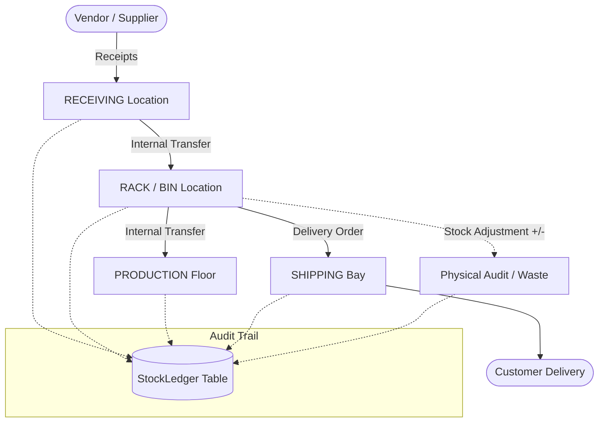
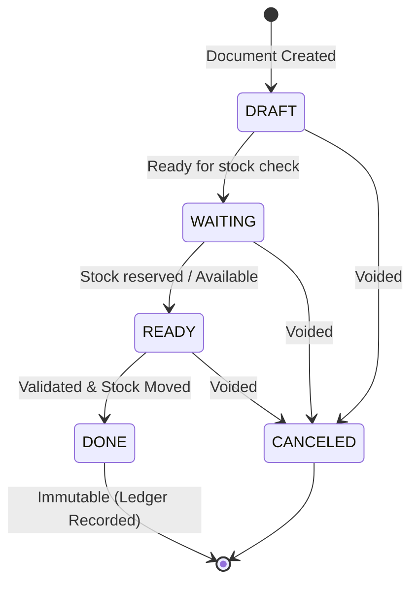

# 🚀 StockSense | Master API & Architecture Documentation

> **Base URL:** `http://localhost:5000/api`  
> **API Version:** `v1.0.0`  
> **Architecture Pattern:** Modular Feature-Driven (Controllers, Routes, Services, Config)  
> **Database:** PostgreSQL on Neon via Prisma ORM  

---

## 📑 Table of Contents
1. [System Overview & Global Configuration](#1-system-overview--global-configuration)
2. [High-Level Architecture & Movement Engine](#2-high-level-architecture--movement-engine)
3. [Database Models & Entity Specifications](#3-database-models--entity-specifications)
4. [Document Lifecycle & State Machine](#4-document-lifecycle--state-machine)
5. [Warehouse Module APIs](#5-warehouse-module-apis)
6. [Location Module APIs](#6-location-module-apis)
7. [Stock & Inventory Module APIs](#7-stock--inventory-module-apis)
8. [Delivery Orders Module APIs](#8-delivery-orders-module-apis)
9. [Receipts (Incoming Stock) Module APIs](#9-receipts-incoming-stock-module-apis)
10. [Internal Transfers Module APIs](#10-internal-transfers-module-apis)
11. [Stock Adjustments Module APIs](#11-stock-adjustments-module-apis)
12. [Standard Response & Error Codes](#12-standard-response--error-codes)

---

## 1. System Overview & Global Configuration

StockSense is an enterprise-grade Inventory Management System (IMS) designed to replace fragmented spreadsheets and manual registers with real-time, automated tracking of multi-warehouse inventory movements.

### 🌐 Global Headers
| Header | Value | Mandatory | Description |
|---|---|---|---|
| `Content-Type` | `application/json` | YES | Required for all `POST`, `PUT`, and `PATCH` requests |
| `Authorization` | `Bearer <JWT_TOKEN>` | Optional / Future | JWT authentication token |

### 📦 Standard JSON Response Envelope
All API endpoints follow a consistent response envelope:

#### Success Response
```json
{
  "success": true,
  "message": "Operation descriptive message (optional)",
  "data": {}
}
```

#### Error Response
```json
{
  "success": false,
  "message": "Human-readable error explanation",
  "error": "Error details or stack trace (in development)"
}
```

---

## 2. High-Level Architecture & Movement Engine

Every movement of goods in StockSense follows an immutable **Stock Ledger** audit trail. Real-time on-hand quantities at any location are reconciled with every movement.



---

## 3. Database Models & Entity Specifications

### 3.1 Warehouse Model
Represents a physical warehouse facility.
| Field | Type | Attributes | Description |
|---|---|---|---|
| `id` | `String (UUID)` | `@id, @default(uuid())` | Unique identifier |
| `name` | `String` | Indexed | Facility display name |
| `code` | `String` | `@unique` | Unique identifier code (e.g., `WH-MUMBAI`) |
| `address` | `String?` | Optional | Physical address |
| `isActive` | `Boolean` | `@default(true)` | Active operational status |
| `createdAt` | `DateTime` | `@default(now())` | Timestamp |
| `updatedAt` | `DateTime` | `@updatedAt` | Auto timestamp |

### 3.2 Location Model
Represents spaces, zones, racks, or bins within a warehouse.
| Field | Type | Attributes | Description |
|---|---|---|---|
| `id` | `String (UUID)` | `@id, @default(uuid())` | Unique identifier |
| `warehouseId` | `String (UUID)` | Foreign Key `Warehouse.id` | Parent warehouse (Cascade delete) |
| `parentId` | `String (UUID)?` | Foreign Key `Location.id` | Self-relation for hierarchy (e.g., Bin inside Rack) |
| `name` | `String` | - | Location name |
| `code` | `String` | `@@unique([warehouseId, code])` | Unique code within warehouse |
| `type` | `LocationType` | Enum | `WAREHOUSE`, `RACK`, `BIN`, `PRODUCTION`, `RECEIVING`, `SHIPPING` |
| `isActive` | `Boolean` | `@default(true)` | Operational flag |

### 3.3 Stock Model (Real-time Balance)
Current aggregated on-hand quantity per product per location.
| Field | Type | Attributes | Description |
|---|---|---|---|
| `id` | `String (UUID)` | `@id, @default(uuid())` | Unique balance entry |
| `productId` | `String (UUID)` | Foreign Key `Product.id` | Referenced item |
| `locationId` | `String (UUID)` | Foreign Key `Location.id` | Location containing item |
| `quantity` | `Decimal(12,2)` | `@default(0)` | On-hand quantity |
| `reserved` | `Decimal(12,2)` | `@default(0)` | Reserved for pending delivery |

---

## 4. Document Lifecycle & State Machine

Operations (`Receipt`, `Delivery`, `Transfer`, `Adjustment`) implement a strict state machine:



* **DRAFT**: Editable draft, no stock impact.
* **WAITING**: Waiting for availability or vendor shipment.
* **READY**: Stock confirmed or reserved.
* **DONE**: Document is finalized. **Stock is physically moved and `StockLedger` entry is created.**
* **CANCELED**: Operation aborted. Reserved stock released.

---

## 5. Warehouse Module APIs

### 5.1 Get All Warehouses
* **URL:** `/api/warehouses`
* **Method:** `GET`
* **Query Parameters:** None

#### Response `200 OK`
```json
{
  "success": true,
  "data": [
    {
      "id": "c1f7a83d-6b58-4441-9a74-0f339cf0b01c",
      "name": "Central Hub Delhi",
      "code": "WH-DELHI",
      "address": "Plot 45, Sector 18, Gurugram",
      "isActive": true,
      "createdAt": "2026-09-26T06:00:00.000Z",
      "updatedAt": "2026-09-26T06:00:00.000Z",
      "_count": {
        "locations": 4
      }
    }
  ]
}
```

---

### 5.2 Get Warehouse By ID
* **URL:** `/api/warehouses/:id`
* **Method:** `GET`

#### Response `200 OK`
```json
{
  "success": true,
  "data": {
    "id": "c1f7a83d-6b58-4441-9a74-0f339cf0b01c",
    "name": "Central Hub Delhi",
    "code": "WH-DELHI",
    "address": "Plot 45, Sector 18, Gurugram",
    "isActive": true,
    "locations": [
      {
        "id": "84c8fb27-6f81-4235-9cb2-938814ec4f31",
        "name": "Receiving Bay 1",
        "code": "REC-01",
        "type": "RECEIVING",
        "isActive": true
      }
    ]
  }
}
```

---

### 5.3 Create Warehouse
* **URL:** `/api/warehouses`
* **Method:** `POST`

#### Request Body
```json
{
  "name": "Mumbai Logistics Park",
  "code": "WH-MUMBAI",
  "address": "Bhiwandi Industrial Area, Mumbai",
  "isActive": true
}
```

#### Response `201 Created`
```json
{
  "success": true,
  "message": "Warehouse created",
  "data": {
    "id": "e9b23f81-22d7-4632-8df2-8cb14c478a22",
    "name": "Mumbai Logistics Park",
    "code": "WH-MUMBAI",
    "address": "Bhiwandi Industrial Area, Mumbai",
    "isActive": true,
    "createdAt": "2026-09-26T07:15:00.000Z"
  }
}
```

#### Error Response `409 Conflict`
```json
{
  "success": false,
  "message": "Code 'WH-MUMBAI' already exists"
}
```

---

### 5.4 Update Warehouse
* **URL:** `/api/warehouses/:id`
* **Method:** `PUT`

#### Request Body
```json
{
  "name": "Mumbai Central Hub",
  "isActive": true
}
```

#### Response `200 OK`
```json
{
  "success": true,
  "message": "Warehouse updated",
  "data": {
    "id": "e9b23f81-22d7-4632-8df2-8cb14c478a22",
    "name": "Mumbai Central Hub",
    "code": "WH-MUMBAI",
    "isActive": true
  }
}
```

---

### 5.5 Delete Warehouse
* **URL:** `/api/warehouses/:id`
* **Method:** `DELETE`

#### Response `200 OK`
```json
{
  "success": true,
  "message": "Warehouse deleted"
}
```

---

## 6. Location Module APIs

### 6.1 Get All Locations
* **URL:** `/api/locations`
* **Method:** `GET`
* **Query Parameters:**
  * `warehouseId` (optional): Filter locations belonging to a specific warehouse.
  * `type` (optional): Filter by `LocationType` (`WAREHOUSE`, `RACK`, `BIN`, `PRODUCTION`, `RECEIVING`, `SHIPPING`).

#### Response `200 OK`
```json
{
  "success": true,
  "data": [
    {
      "id": "84c8fb27-6f81-4235-9cb2-938814ec4f31",
      "warehouseId": "c1f7a83d-6b58-4441-9a74-0f339cf0b01c",
      "parentId": null,
      "name": "Zone A - Bulk Storage",
      "code": "ZONE-A",
      "type": "WAREHOUSE",
      "isActive": true,
      "warehouse": {
        "id": "c1f7a83d-6b58-4441-9a74-0f339cf0b01c",
        "name": "Central Hub Delhi",
        "code": "WH-DELHI"
      },
      "parent": null,
      "children": [
        {
          "id": "99ea7f12-0033-4bc1-bb81-a982cb1231a4",
          "name": "Rack 01",
          "code": "RACK-01",
          "type": "RACK"
        }
      ]
    }
  ]
}
```

---

### 6.2 Create Location
* **URL:** `/api/locations`
* **Method:** `POST`

#### Request Body
```json
{
  "warehouseId": "c1f7a83d-6b58-4441-9a74-0f339cf0b01c",
  "parentId": "84c8fb27-6f81-4235-9cb2-938814ec4f31",
  "name": "Shelf Level 3",
  "code": "SHELF-03",
  "type": "BIN",
  "isActive": true
}
```

#### Response `201 Created`
```json
{
  "success": true,
  "message": "Location created successfully",
  "data": {
    "id": "f29da143-6c7b-402a-9821-6677aa11bb02",
    "warehouseId": "c1f7a83d-6b58-4441-9a74-0f339cf0b01c",
    "parentId": "84c8fb27-6f81-4235-9cb2-938814ec4f31",
    "name": "Shelf Level 3",
    "code": "SHELF-03",
    "type": "BIN",
    "isActive": true,
    "createdAt": "2026-09-26T07:30:00.000Z"
  }
}
```

---

### 6.3 Update Location
* **URL:** `/api/locations/:id`
* **Method:** `PUT`

#### Request Body
```json
{
  "name": "Shelf Level 3 (Fast Moving)",
  "isActive": true
}
```

#### Response `200 OK`
```json
{
  "success": true,
  "message": "Location updated successfully",
  "data": {
    "id": "f29da143-6c7b-402a-9821-6677aa11bb02",
    "name": "Shelf Level 3 (Fast Moving)",
    "code": "SHELF-03",
    "type": "BIN"
  }
}
```

---

### 6.4 Delete Location
* **URL:** `/api/locations/:id`
* **Method:** `DELETE`

#### Response `200 OK`
```json
{
  "success": true,
  "message": "Location deleted successfully"
}
```

---

## 7. Stock & Inventory Module APIs

### 7.1 Get Stock Balances
* **URL:** `/api/stocks` (or `/api/stock`)
* **Method:** `GET`
* **Query Parameters:**
  * `locationId` (optional)
  * `productId` (optional)
  * `search` (optional: filter by SKU or Product name)

#### Response `200 OK`
```json
{
  "success": true,
  "data": [
    {
      "id": "a183ec90-1122-4433-8899-ccddeeff0011",
      "quantity": 150,
      "reserved": 20,
      "available": 130,
      "product": {
        "id": "p001",
        "name": "Steel Rod 12mm",
        "sku": "ROD-12MM",
        "uom": "KG"
      },
      "location": {
        "id": "loc001",
        "name": "Rack A",
        "code": "RACK-A",
        "warehouse": {
          "name": "Central Hub Delhi"
        }
      }
    }
  ]
}
```

---

### 7.2 Get Stock Ledger (Audit Trail)
* **URL:** `/api/stocks/ledger`
* **Method:** `GET`
* **Query Parameters:** `productId`, `locationId`, `page`, `limit`

#### Response `200 OK`
```json
{
  "success": true,
  "data": [
    {
      "id": "led-001",
      "movementType": "RECEIPT",
      "quantity": 100,
      "reference": "REC-2026-0001",
      "createdAt": "2026-09-26T08:00:00.000Z",
      "product": { "name": "Steel Rod 12mm", "sku": "ROD-12MM" },
      "location": { "name": "Receiving Bay 1", "code": "REC-01" }
    }
  ]
}
```

---

## 8. Delivery Orders Module APIs

### 8.1 Get All Deliveries
* **URL:** `/api/deliveries`
* **Method:** `GET`
* **Query Parameters:** `status`, `search`, `page`, `limit`

#### Response `200 OK`
```json
{
  "success": true,
  "total": 1,
  "page": 1,
  "limit": 10,
  "data": [
    {
      "id": "del-uuid-001",
      "deliveryNumber": "OUT-2026-0001",
      "customerName": "Acme Industries",
      "status": "READY",
      "sourceLocation": { "name": "Rack 01", "code": "RACK-01" },
      "items": [
        {
          "productId": "p001",
          "quantity": 10
        }
      ]
    }
  ]
}
```

---

### 8.2 Create Delivery Order
* **URL:** `/api/deliveries`
* **Method:** `POST`

#### Request Body
```json
{
  "customerName": "Acme Industries",
  "sourceLocationId": "loc-uuid-rack-01",
  "notes": "Urgent shipping",
  "items": [
    {
      "productId": "prod-uuid-001",
      "quantity": 25
    }
  ]
}
```

#### Response `201 Created`
```json
{
  "success": true,
  "message": "Delivery order created",
  "data": {
    "id": "del-uuid-001",
    "deliveryNumber": "OUT-2026-0001",
    "status": "DRAFT"
  }
}
```

---

## 9. Receipts (Incoming Stock) Module APIs

### 9.1 Create Goods Receipt
* **URL:** `/api/receipts`
* **Method:** `POST`

#### Request Body
```json
{
  "supplierName": "Tata Steel Supplies Ltd",
  "destinationLocationId": "loc-uuid-receiving",
  "items": [
    {
      "productId": "prod-uuid-001",
      "expectedQty": 100
    }
  ]
}
```

#### Response `201 Created`
```json
{
  "success": true,
  "message": "Receipt created in DRAFT state",
  "data": {
    "id": "rec-uuid-001",
    "receiptNumber": "IN-2026-0001",
    "status": "DRAFT"
  }
}
```

---

### 9.2 Validate Goods Receipt (Increases Stock)
* **URL:** `/api/receipts/:id/validate`
* **Method:** `POST`

#### Action Logic:
1. Verifies quantities received.
2. Increases `Stock.quantity` at `destinationLocationId`.
3. Records immutable `RECEIPT` entry in `StockLedger`.
4. Updates Receipt state to `DONE`.

#### Response `200 OK`
```json
{
  "success": true,
  "message": "Receipt validated. Stock updated and ledger recorded.",
  "data": {
    "status": "DONE"
  }
}
```

---

## 10. Internal Transfers Module APIs

### 10.1 Create & Validate Internal Transfer
* **URL:** `/api/transfers`
* **Method:** `POST`

#### Request Body
```json
{
  "sourceLocationId": "loc-uuid-receiving",
  "destinationLocationId": "loc-uuid-rack-a",
  "items": [
    {
      "productId": "prod-uuid-001",
      "quantity": 50
    }
  ]
}
```

#### Action Logic:
1. Checks that `sourceLocationId` has $\ge 50$ available units.
2. Decrements `Stock` at Source (`TRANSFER_OUT`).
3. Increments `Stock` at Destination (`TRANSFER_IN`).
4. Logs two synchronized audit entries in `StockLedger`.

#### Response `201 Created`
```json
{
  "success": true,
  "message": "Transfer processed successfully",
  "data": {
    "transferNumber": "INT-2026-0001",
    "status": "DONE"
  }
}
```

---

## 11. Stock Adjustments Module APIs

### 11.1 Create Stock Adjustment (Physical Count Audit)
* **URL:** `/api/adjustments`
* **Method:** `POST`

#### Request Body
```json
{
  "locationId": "loc-uuid-rack-a",
  "reason": "Annual physical count discrepancy",
  "items": [
    {
      "productId": "prod-uuid-001",
      "recordedQty": 100,
      "countedQty": 97
    }
  ]
}
```

#### Action Logic:
* Difference $= 97 - 100 = -3$ units.
* Sets new Stock quantity to `97`.
* Logs `ADJUSTMENT_OUT` with quantity `3` in `StockLedger`.

#### Response `201 Created`
```json
{
  "success": true,
  "message": "Adjustment validated and ledger reconciled",
  "data": {
    "adjustmentNumber": "ADJ-2026-0001",
    "status": "DONE"
  }
}
```

---

## 12. Standard Response & Error Codes

| HTTP Status | Name | Meaning in StockSense |
|---|---|---|
| `200 OK` | Success | Request succeeded with payload data |
| `201 Created` | Resource Created | Warehouse, Location, or Document initialized |
| `400 Bad Request` | Validation Failure | Missing mandatory fields (e.g. `warehouseId`, `type`) |
| `404 Not Found` | Resource Missing | Warehouse or Location ID does not exist |
| `409 Conflict` | Unique Violation | Code already in use (`WH-DELHI`, duplicate code in warehouse) |
| `500 Server Error` | Unhandled Error | Database connection drop or unexpected exception |
